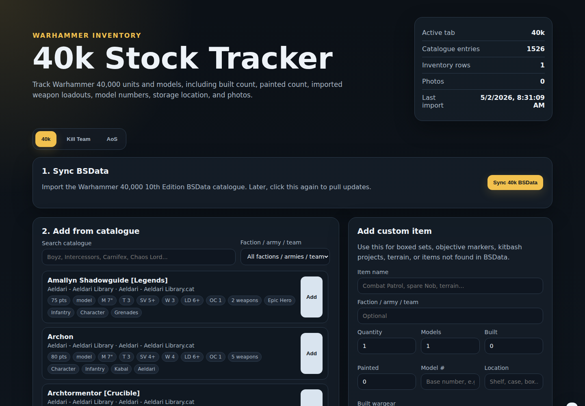
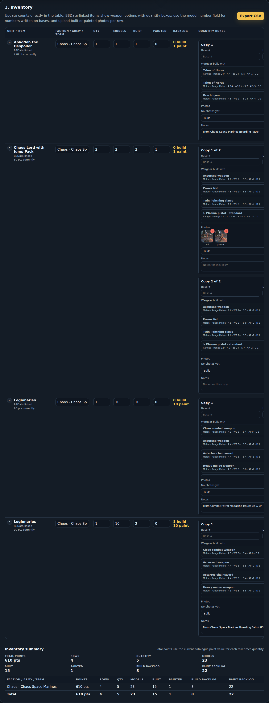
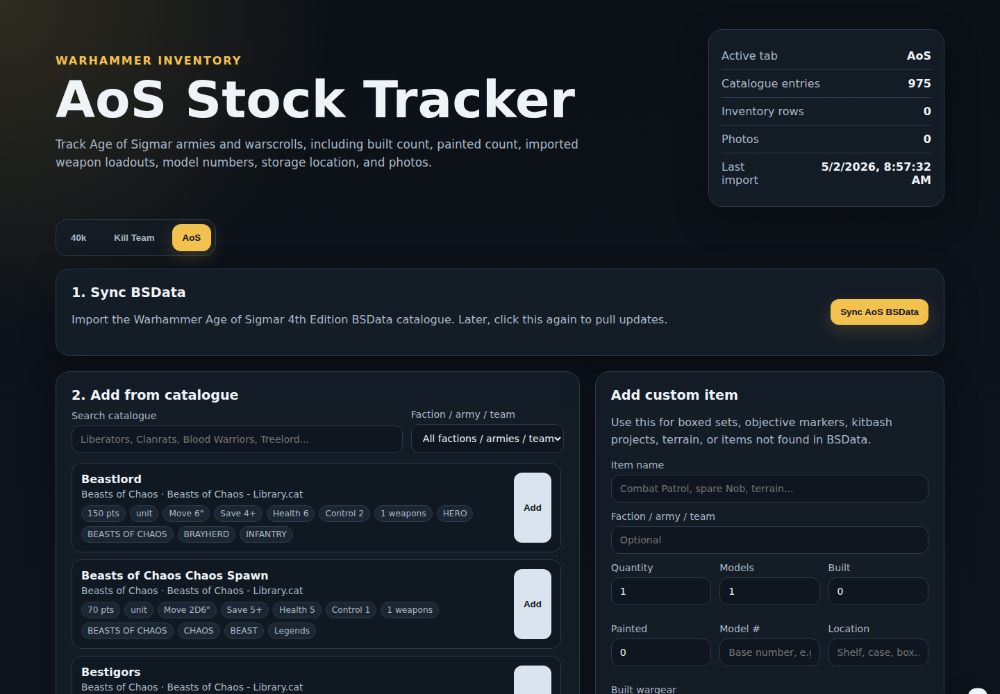

# Warhammer Stock Tracker

A small Python web app for tracking which Warhammer 40,000, Kill Team, and Age of Sigmar models you own. It uses:

- **FastAPI** for the web app and JSON API
- **SQLite** for a lightweight local database
- **Vanilla HTML/CSS/JavaScript** for the front end
- **BSData/wh40k-10e** for Warhammer 40,000 catalogue data
- **BSData/wh40k-killteam** for Kill Team catalogue data
- **BSData/age-of-sigmar-4th** for Age of Sigmar catalogue data

When run directly, the app stores your inventory locally in `data/stock_tracker.db`, stores uploaded photos in `data/uploads/`, and downloads/clones BSData files into `data/bsdata/`. In Docker, `/app/data` is backed by the `wh40k-stock-data` named volume.

## Features

- Top tabs for **40k**, **Kill Team**, and **AoS**.
- Sync each game system separately from BSData.
- Parse `.cat` files and import names, factions/teams, points when present, valid unit sizes where exposed, keywords, basic stats, unit/model datasheet entries, and weapon profile options where BSData exposes them.
- Search imported catalogue entries and add them to your collection.
- Add custom rows for boxed sets, kitbashes, terrain, spare models, bespoke Kill Team operatives, AoS projects, or anything not in BSData.
- Track quantity, models owned, built count, painted count, build backlog, paint backlog, storage location, and notes.
- Split each inventory row into per-quantity copy boxes for base number, wargear, photos, location, and copy notes.
- Collapse inventory rows to hide copy boxes while keeping totals and backlog visible.
- Track **wargear built on the model** from an imported weapon list, with per-weapon quantity controls.
- Track **model number(s)**, for example a number written under a figure base.
- Upload photos for each inventory row and mark each photo as built, painted, WIP, reference, or other.
- Export the current tab's inventory as CSV.
- Optional username/password login for public hosting, with an admin-only user creation portal.
- Uses local SQLite only; no hosted service is required.

## Screenshots







## Quick start

```bash
python -m venv .venv
source .venv/bin/activate
pip install -r requirements.txt
python run.py
```

On Windows PowerShell:

```powershell
python -m venv .venv
.\.venv\Scripts\Activate.ps1
pip install -r requirements.txt
python run.py
```

Open the app at:

```text
http://127.0.0.1:8000
```

Then choose the **40k**, **Kill Team**, or **AoS** tab and click **Sync BSData** under **Last import**.

To run the local dev server with login enabled:

```bash
python run.py --auth
```

Set `WH40K_PORT` to change the listen port without passing `--port`:

```bash
WH40K_PORT=9000 python run.py
```

## Optional Docker run

Create a named Docker volume once, then run with Compose. The SQLite database, uploads, and downloaded BSData live in `wh40k-stock-data`, so they survive container recreation:

```bash
docker volume create wh40k-stock-data
docker compose up --build
```

Or with plain Docker:

```bash
docker build -t wh40k-stock-tracker .
docker volume create wh40k-stock-data
docker run --rm -p 8000:8000 --mount source=wh40k-stock-data,target=/app/data wh40k-stock-tracker
```

Then open `http://127.0.0.1:8000`.

To run Docker on another port, set `WH40K_PORT` for both the app and Compose port mapping:

```bash
WH40K_PORT=9000 docker compose up --build
```

With plain Docker:

```bash
docker run --rm -p 9000:9000 \
  -e WH40K_PORT=9000 \
  --mount source=wh40k-stock-data,target=/app/data \
  wh40k-stock-tracker
```

## Optional authentication

Authentication is off by default for local use. To require a login when hosting publicly, enable it at runtime:

```bash
WH40K_AUTH_ENABLED=true docker compose up --build
```

With plain Docker:

```bash
docker run --rm -p 8000:8000 \
  -e WH40K_AUTH_ENABLED=true \
  --mount source=wh40k-stock-data,target=/app/data \
  wh40k-stock-tracker
```

On the first startup with auth enabled, if no admin user exists, the app creates `admin` with a temporary password and prints it to the container logs. Read it with:

```bash
docker compose logs web
```

Sign in, open `/admin`, and set your permanent admin password. Users can only be created from `/admin`; there is no public account registration page. When auth is enabled, each user has their own inventory list and uploaded photos; BSData catalogue imports are shared.

Useful auth environment variables:

- `WH40K_AUTH_ENABLED=true` - require login for the app, API, and uploads.
- `WH40K_PORT=8000` - listen on a different app/container port. The Docker Compose file also maps this as the host port.
- `PORT=8000` - fallback listen-port variable for hosting platforms that provide `PORT`.
- `WH40K_ADMIN_USERNAME=admin` - initial admin username when bootstrapping auth.
- `WH40K_SESSION_DAYS=30` - login session lifetime.
- `WH40K_COOKIE_SECURE=true` - use this when serving only over HTTPS.

## How syncing works

The app tries to use `git` first. Later syncs use `git pull --ff-only`.

Warhammer 40,000 10th Edition:

```bash
git clone --depth 1 --branch main https://github.com/BSData/wh40k-10e.git
```

Kill Team:

```bash
git clone --depth 1 --branch master https://github.com/BSData/wh40k-killteam.git
```

Age of Sigmar 4th Edition:

```bash
git clone --depth 1 --branch main https://github.com/BSData/age-of-sigmar-4th.git
```

If `git` is not installed, the app downloads the matching branch zip from GitHub and unpacks it.

## API endpoints

Most read endpoints accept a `game_system` query parameter. Valid values are:

- `wh40k_10e`
- `kill_team`
- `age_of_sigmar_4e`

Main endpoints:

- `GET /` - web front end
- `GET /login` - login page when auth is enabled
- `GET /admin` - admin portal for setting the admin password and creating users
- `GET /api/game-systems` - available game systems
- `POST /api/sync/wh40k_10e` - clone/pull 40k BSData and import `.cat` files
- `POST /api/sync/kill_team` - clone/pull Kill Team BSData and import `.cat` files
- `POST /api/sync/age_of_sigmar_4e` - clone/pull Age of Sigmar BSData and import `.cat` files
- `GET /api/status?game_system=wh40k_10e` - database and import status
- `GET /api/factions?game_system=kill_team` - imported factions/teams
- `GET /api/factions?game_system=age_of_sigmar_4e` - imported factions/armies
- `GET /api/units?game_system=wh40k_10e&query=chaos%20lord` - search imported catalogue entries
- `GET /api/inventory?game_system=kill_team` - list inventory for the selected tab
- `GET /api/inventory?game_system=age_of_sigmar_4e` - list AoS inventory
- `POST /api/inventory` - add inventory item
- `PUT /api/inventory/{id}` - update inventory item
- `DELETE /api/inventory/{id}` - delete inventory item and its local photos
- `PUT /api/inventory/{id}/copies/{copy_id}` - update one per-quantity copy box
- `POST /api/inventory/{id}/images` - upload a JPG, PNG, WebP, or GIF photo
- `POST /api/inventory/{id}/copies/{copy_id}/images` - upload a photo to one per-quantity copy
- `DELETE /api/images/{image_id}` - delete a photo
- `GET /api/export.csv?game_system=wh40k_10e` - export the selected tab as CSV

## Data model notes

`bsd_units` contains imported catalogue data, scoped by `game_system`, including `wargear_options_json` for weapon profiles and `model_composition_json` for model-specific unit composition discovered in the `.cat` XML. `inventory_items` contains your own collection, scoped by `game_system` and, when auth is enabled, `owner_user_id`. `inventory_copies` stores one child record per inventory quantity, including per-copy base number, wargear selections, location, notes, and photos. Inventory rows keep a snapshot of the unit name and faction/team so your collection remains readable even if a catalogue entry is renamed or removed in a later BSData update.

Uploaded images are stored under `data/uploads/inventory/{inventory_item_id}/`, or `/app/data/uploads/inventory/{inventory_item_id}/` in Docker. They are served locally by the app under `/uploads/...` and are not sent anywhere.

## Upgrading from the first version

The app performs lightweight SQLite migrations on startup:

- Adds `game_system` columns so existing 40k inventory remains under `wh40k_10e`.
- Adds `wargear`, `wargear_selections_json`, and `model_number` columns.
- Adds the `inventory_images` table for local photo uploads.
- Adds `inventory_copies` and links uploaded images to the relevant per-quantity copy when available.
- Adds `auth_users` and `auth_sessions` for optional local login protection.
- Adds `owner_user_id` to inventory rows. On the first auth-enabled startup after upgrading, existing unowned inventory is assigned to the first admin account.

Keep a copy of `data/stock_tracker.db` before upgrading if you want an easy rollback.

## Importer notes

The original importer only accepted catalogue entries marked exactly as `type="unit"`. This version also imports `type="model"` entries, which helps with character entries such as Chaos Lords and with Kill Team operative-style entries. It still ignores entries marked as upgrades/wargear.

BSData catalogue XML can vary between factions and releases. The importer looks for weapon-style profiles, including nested entries and linked profiles/entry links. For Age of Sigmar, `- Library` catalogue suffixes are removed from faction names shown in the app. If no weapon list can be found for a row, the UI falls back to a free-text wargear notes box. This app is meant as a stock tracker, not a full army builder.

This project is not affiliated with Games Workshop, BattleScribe, New Recruit, or BSData.
